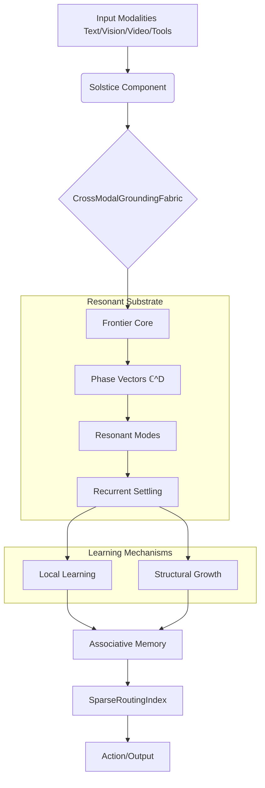

# Resonant Learning Fabric (RLF) Architecture

## 1. System Overview

The Resonant Learning Fabric (RLF) is a C++23 non-neural learning architecture research prototype, designed from the ground up without relying on backpropagation or traditional neural network primitives. Instead, RLF employs complex-valued phase vectors (ℂ^D unit circle) and resonant modes to perform computation, representation, and learning.

At its core, RLF is a dynamical system that achieves stability and representation through **recurrent settling**, modifies itself through **local learning** and **structural growth**, and operates with strict **associative memory** capacities. 



## 2. Directory and Module Structure

The `src/` hierarchy is carefully partitioned into 13 distinct subdirectories reflecting the boundaries of the architecture:

- **`agent/`**: Embodied and simulated agent logic, reasoning loops, and environment interfacing.
- **`backend/`**: Hardware acceleration backends, specifically CUDA kernels for GPU profiles (H100, H200, 3090), and SIMD-optimized CPU fallbacks.
- **`baselines/`**: Standardized fallback models and non-RLF classical baselines for comparative evaluation.
- **`benchmarks/`**: High-performance throughput and latency tests measuring phase vector convergence times and memory bandwidth.
- **`cli/`**: Command-line interfaces, dataset ingestion drivers, and interactive REPLs.
- **`core/`**: Fundamental mathematical constructs (15 primary headers). Defines the `ComplexPhaseVector` and substrate geometry.
- **`experiments/`**: Campaign definitions, hyperparameter grids, and configuration for large-scale runs.
- **`frontier/`**: The state-of-the-art research components (AbstractionFabric, ContinualLearningFabric, CrossModalGroundingFabric, SparseRoutingIndex).
- **`learning/`**: Local learning rules, Hebbian-like phase updates, and structural growth allocators. No backprop.
- **`memory/`**: Implementation of distributed associative memory, capable of exact and fuzzy retrieval of phase vectors.
- **`retrieval/`**: High-dimensional index structures for fast nearest-neighbor lookups of complex vectors.
- **`solstice/`**: The multimodal system suite (26 primary headers) bridging text, vision, video, tool-use, and dialogue into unified phase spaces.
- **`storage/`**: Checkpoint management (format v6), transactional persistence, and corruption-rejecting serialization.

## 3. Data Flow: The Phase Vector Lifecycle

Computation in RLF is not a forward pass; it is a resonance search.

1. **Encoding**: An input (e.g., a token, an image patch) is mapped via Solstice to a high-dimensional unit-circle vector in ℂ^D.
2. **Injection**: This phase vector acts as a forcing function injected into the active AbstractionFabric.
3. **Recurrent Settling**: The fabric consists of coupled oscillators. Driven by the input, the network iterates to a steady-state or limit cycle (a "resonant mode"). 
4. **Extraction**: The steady-state phase vector is read out. Its geometric properties in ℂ^D encode the synthesized representation.

```text
[Input X] --> (Encoder) --> φ(X) ∈ ℂ^D
                               |
                               v
                       +---------------+
                       |   Resonant    | <--> [Associative Memory]
                       |   Fabric      |
                       +---------------+
                               |
                               v
                     φ(Y) (Settled State)
                               |
                               v
[Output Y] <-- (Decoder) ------+
```

## 4. Learning Pipeline

Learning in RLF operates fundamentally differently from SGD. 
- **Local Learning**: Updates to connections between oscillators only depend on the instantaneous phases of the connected units (phase-locking updates). There is no global error signal propagated backward.
- **Structural Growth**: If the system fails to settle into a known resonant mode (high surprise/energy), the `ContinualLearningFabric` dynamically allocates new oscillator nodes and edges. This allows one-shot schema induction.

## 5. Solstice Multimodal Architecture

Solstice handles the mapping of human-interpretable modalities into the alien phase space of RLF.
- **Text**: Character/BPE sequences are bound using vector symbolic architectures (VSA) on phase angles.
- **Vision & Video**: Spatial and temporal frequencies are directly mapped to phase components.
- **Tools/Dialogue**: Action schemas are represented as phase trajectories.

## 6. Frontier Research Edition Components

The latest architectural evolution (Version 11.0.0) introduces the Frontier core:
- **`AbstractionFabric`**: Discovers hierarchical phase invariants.
- **`ContinualLearningFabric`**: Learns without catastrophic forgetting by orthogonalizing new memories in the complex domain.
- **`CrossModalGroundingFabric`**: Binds Solstice modalities into a unified representation.
- **`SparseRoutingIndex`**: Routes settled phase vectors to the most relevant memory banks efficiently, unlocking >100K token equivalent contexts.

## 7. Storage and Checkpoint Architecture

RLF Checkpoint Format 6 is designed for extreme reliability during massive training campaigns.
- **Transactional**: Writes are atomic. The system maintains a write-ahead log.
- **Corruption-Rejecting**: Cryptographic checksums of phase blocks ensure no bit-flip (common in H100 scale-out) poisons the model.
- **Structure**: Checkpoints separate the topological graph of oscillators from their current phase states.

## 8. Build System

- **Requirement**: CMake 3.25+, C++23 compiler (GCC 13+ or Clang 17+).
- **Generator**: Ninja (strict requirement for parallel module builds).
- **Presets**: 
  - `dev-asan`, `dev-ubsan` for rigorous memory and UB checking.
  - `release-cuda` for H100/H200 campaign deployments.

## 9. GPU Backend Architecture

The backend minimizes memory bandwidth bottlenecks inherent to complex numbers:
- **`frontier-24g`**: Optimized for RTX 3090/4090 research desktops. Heavy tiling.
- **`frontier-h100`**: Takes advantage of TMA (Tensor Memory Accelerator) and Hopper's specialized warp group primitives to execute distributed recurrent settling.
- **`general-h200-141g-30t`**: Scaled out for 141GB memory profiles to test >1M capacity phase routing indices.

## 10. Key Design Decisions and Rationale

1. **Why C++23?** The architecture requires extreme low-level control over memory layouts for complex arrays and custom SIMD dispatch, along with modern paradigms (concepts, ranges) for expressive graph definitions.
2. **Why No PyTorch/TF?** Auto-grad frameworks fundamentally assume a differentiable, forward/backward computation graph. RLF is a dynamical system updated via local, non-differentiable phase-locking rules. Implementing this in PyTorch results in massive overhead.
3. **Why Phase Vectors?** Unit vectors in ℂ^D perfectly capture cyclic phenomena, inherently represent binding (via element-wise multiplication), and avoid exploding gradients (magnitudes are fixed to 1; only angles change).
